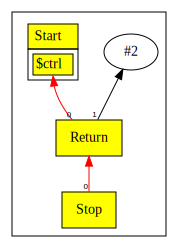
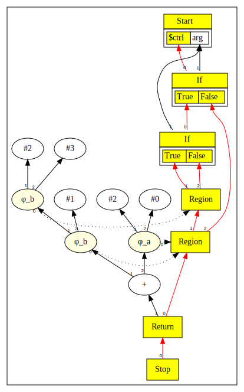

# Chapter 6

In this chapter we do not add new language features. Our goal is to add peephole optimization to `if` statements.

## Type System Revision

We now need to extend the type system to introduce another lattice structure, in addition to the Integer lattice.
As before we denote  "top" by T and "bottom" by ⊥.

* "ctrl" represents a live control, whereas "~ctrl" represents a dead control.
* "INT" refers to the integer type.

|       | ⊥ | Ctrl | ~Ctrl | T     | INT |
|-------|---|------|-------|-------|-----|
| T     | ⊥ | Ctrl | ~Ctrl | T     | INT |
| Ctrl  | ⊥ | Ctrl | Ctrl  | Ctrl  | ⊥   |
| ~Ctrl | ⊥ | Ctrl | ~Ctrl | ~Ctrl | ⊥   |
| ⊥     | ⊥ | ⊥    | ⊥     | ⊥     | ⊥   |

* "top" meets any type is that type,
* "bottom" meets any type is "bottom",
* "top", "bottom", "ctrl", "~ctrl" are classed as simple types,
* "ctrl" meets "~ctrl" is "ctrl"
* Unless covered above, a simple type meets non-simple results in "bottom"

## Peephole of `if` 

* Our general strategy is to continue parsing the entire `if` statement even if we know that one branch is dead.
* This approach creates dead nodes which get cleaned up by dead code
  elimination.  The benefits are that we do not introduce special logic during
  parsing, the normal graph building machinery takes care of cleaning up dead
  nodes.
* When we peephole an `If` node we test if the predicate is a constant.  If so,
  then one branch or the other dead, depending on if the constant is `0` or not.
* When we add the `Proj` nodes, in this scenario, we already know one of the projections is dead.  The peephole of the
  relevant `Proj` node replaces the `Proj` with a `Constant` of type "~ctrl" indicating dead control.
* At this point our dead code elimination would kill the `If` node since it has no uses
   - but we cannot do that because we need to continue the parse.  The
  important observation is that *we __can__ kill the `If` node after __both__
  the `Proj` nodes have been created*, because any subsequent control flow can
  only see the `Proj` nodes.
* To ensure this, we add a dummy user to `If` before creating the first `Proj` and remove it immediately after, allowing the 
  second `Proj` to trigger a dead code elimination of the `If`.
* The live `Proj` gets replaced by the parent of `If`, whereas the dead `Proj` gets replaced by "~ctrl".
* The parsing then continues as normal.
* The other changes are when we reach the merge point with a dead control.
* Again keeping with our strategy we merge as normal, including creating `Phi` nodes.
* The `Region` may have have one of its inputs as "~ctrl".  This will be seen
  by the `Phi` which then optimizes itself.  If the `Phi` has just one live
  input, the `Phi` peephole replaces itself with the remaining input.  
* Finally, at the end, when the `Region` node is peepholed, we see that it has only one live input and no Phi uses
  and can be replaced with its one live input.

## Discussion of `Region` and `Phi`

One of the invariants we maintain is that the for each control input to a
`Region` every `Phi` has a 1-to-1 relationship with a data input.  Thus, if a
`Region` loses a control input, every `Phi`'s corresponding data input must be
deleted.  Conversely, we cannot collapse a Region until it has no dependent
`Phi`s.

When processing `If` we do not remove control inputs to a `Region`, instead the
dead control input is simply set to `Constant(~ctrl)`.  The peephole logic in
a `Phi` notices this and replaces itself with the live input.

## Examples

We show a number of examples of peephole in action.

### Example 1

```java
if( true ) return 2;
return 1;
```

Before peephole:


After peephole:



### Example 2

```java
int a=1;
if( true )
  a=2;
else
  a=3;
return a;
```

Before peephole:


After peephole:


### Example 3

```java
int a = 0;
int b = 1;
if( arg ) {
    a = 2;
    if( arg ) { b = 2; }
    else b = 3;
}
return a+b;
```

In this example, `arg` is defined externally. If `arg` is given a non-constant value, then the graph looks like this:



If we set `arg` to a non-zero constant such as `1` we get:


If we set `arg` to `0` which means false, then:


### Example 4

```java
int a = 0;
int b = 1;
int c = 0;
if( arg ) {
    a = 1;
    if( arg==2 ) { c=2; } else { c=3; }
    if( arg ) { b = 2; }
    else b = 3;
}
return a+b+c;
```

In this example, `arg` is defined externally. If `arg` is given a non-constant value, then the graph looks like this:


If we set `arg` to `1` we get:


If we set `arg` to `2`, then:


